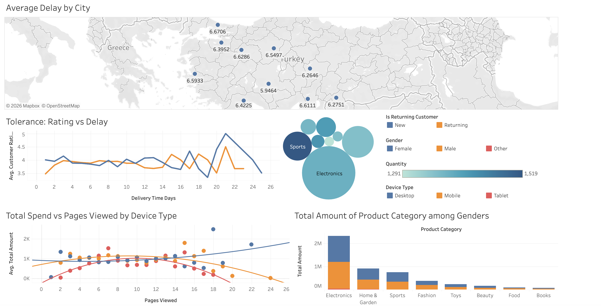

# E-Commerce Customer Behavior Analysis

STAT 112 group project. Exploratory data analysis and an interactive Tableau dashboard built on a Turkish e-commerce dataset (5,000 transactions, Jan 2023 to Mar 2024).

Dataset is from Kaggle (CC0). Our work here is the analysis and the dashboard, not the data collection.

## What's in the dashboard

- Average delivery delay by city, on a map
- Customer rating vs delivery delay, split by new/returning customers
- Total spend vs pages viewed, by device type, with trend lines
- Product category breakdown by gender
- Returning customer patterns across categories (bubble chart)

## Files

- `dash.twbx` — Tableau workbook
- `ecommerce_customer_behavior_dataset.csv` — the dataset
- `docs/` — dataset reference and presentation slides

## Live dashboard

[View on Tableau Public](https://public.tableau.com/app/profile/bar.arslan/viz/dash_17645289779880/Dashboard1)

## Tools

Tableau, plus some Python for cleaning.
